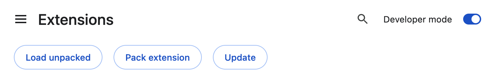

# Notion Empty Trash Chrome Extension

A Chrome extension that adds an "Empty Trash" button to Notion's trash menu. This extension runs entirely in your browser and only interacts with Notion's official API. It does not collect, store, or transmit any data - it simply provides a convenient way to empty your Notion workspace's trash with one click.

## 1. Install

Turn on developer mode in Chrome extensions settings, and use the "Load unpacked" option to add the extension.

## 2. Usage

Adds a button to Notion's trash menu to empty the trash (permanently delete all trashed pages).

